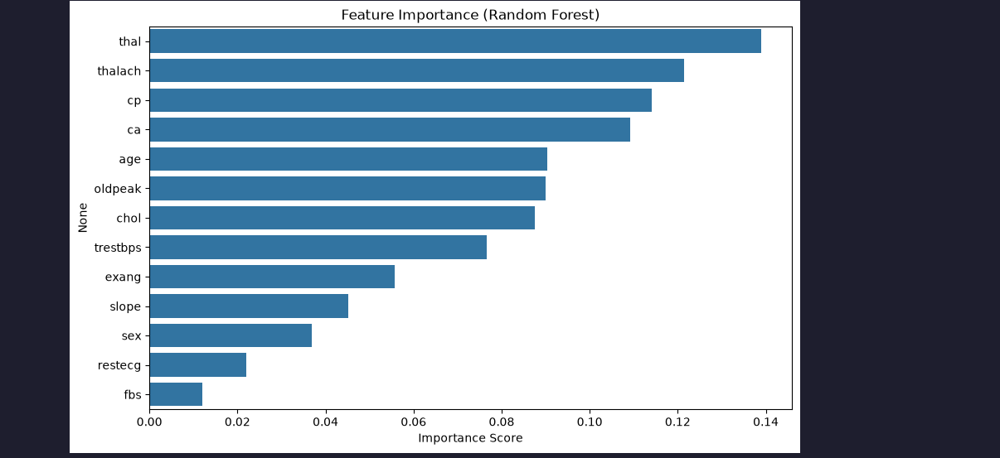
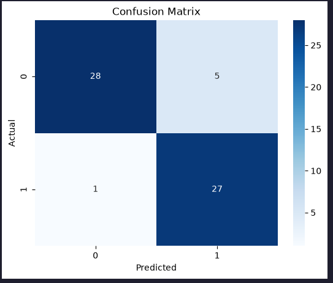
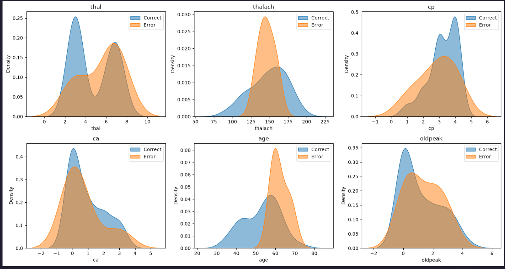

# 🫀 Heart Disease Prediction Using Random Forest

> An interpretable machine learning project using Random Forest to predict the presence of heart disease from clinical and demographic features.

## 📌 Overview

This project applies a **Random Forest classification model** to the **UCI Cleveland Heart Disease dataset**.

The goal is not only to build a classifier, but also to understand **how well the model performs, which features influence its predictions, and where the model makes mistakes**.

The project covers a complete classical machine learning workflow:

**Data Preparation → Model Training → Evaluation → Feature Importance → Error Analysis**

---

## 🎯 Objective

The primary objective is to build a binary classification model that predicts whether a patient shows the presence of heart disease.

The project also investigates:

- How effectively Random Forest separates the two classes
- Which features are most important to the model
- How predictions distribute across the confusion matrix
- Which samples are misclassified
- Whether correctly and incorrectly classified samples show different feature distributions

---

## 📊 Dataset

The project uses the **Cleveland Heart Disease dataset** from the UCI Machine Learning Repository.

The dataset contains clinical and demographic attributes including:

| Feature    | Description                       |
| ---------- | --------------------------------- |
| `age`      | Patient age                       |
| `sex`      | Sex                               |
| `cp`       | Chest pain type                   |
| `trestbps` | Resting blood pressure            |
| `chol`     | Serum cholesterol                 |
| `fbs`      | Fasting blood sugar               |
| `restecg`  | Resting ECG results               |
| `thalach`  | Maximum heart rate achieved       |
| `exang`    | Exercise-induced angina           |
| `oldpeak`  | ST depression                     |
| `slope`    | Slope of peak exercise ST segment |
| `ca`       | Number of major vessels           |
| `thal`     | Thalassemia                       |
| `target`   | Heart disease classification      |

The original target contains multiple disease severity levels. For this project, it is converted into a **binary classification problem**:

- `0` → No presence of heart disease
- `1` → Presence of heart disease

---

## 🧹 Data Preparation

The dataset was inspected and cleaned before model training.

### Steps performed

1. Loaded the Cleveland dataset from the UCI repository
2. Inspected dataset structure and descriptive statistics
3. Checked for missing values
4. Checked for duplicate observations
5. Replaced `"?"` values with `NaN`
6. Converted values to numeric format
7. Filled missing values using median imputation
8. Converted the original multi-class target into a binary target
9. Separated features from the target
10. Performed a stratified 80/20 train-test split

The stratified split helps preserve the class distribution between the training and testing sets.

---

# 🌲 Model

## Random Forest Classifier

The main model used in this project is **Random Forest**, an ensemble learning algorithm based on multiple decision trees.

Instead of relying on one decision tree, Random Forest trains many trees and combines their predictions.

```text
                    Training Data
                         │
          ┌──────────────┼──────────────┐
          ▼              ▼              ▼
       Tree 1          Tree 2         Tree 3
          │              │              │
          ▼              ▼              ▼
       Class 0        Class 1        Class 1
          │              │              │
          └──────────────┼──────────────┘
                         ▼
                  Majority Voting
                         │
                         ▼
                    Final Class
```

### Configuration

The model was trained using:

- **500 decision trees**
- `random_state=42`

Using multiple trees helps reduce the variance of individual decision trees and generally produces a more robust classifier.

---

# 📈 Model Evaluation

The model is evaluated on the **unseen test set**.

Rather than relying only on accuracy, the project examines:

- Accuracy
- Precision
- Recall
- F1-score
- Support
- Confusion Matrix

### Why multiple metrics?

Accuracy alone does not explain _how_ a classifier is making mistakes.

For a medical classification problem, false positives and false negatives can have different implications. Precision and recall therefore provide additional insight into model behavior.

### Classification Report

The final classification report from the published notebook is shown below:

```text
              precision    recall  f1-score   support

           0       0.97      0.85      0.90        33
           1       0.84      0.96      0.90        28

    accuracy                           0.90        61
   macro avg       0.90      0.91      0.90        61
weighted avg       0.91      0.90      0.90        61
```

A strong classifier should ideally demonstrate good precision, recall, and F1-score across both classes rather than relying on a high overall accuracy alone.

---

# 🔎 Feature Importance

Random Forest provides feature importance scores through the `feature_importances_` attribute.

These scores were used to rank the input features according to their contribution to the model's tree-based decision process.

### Feature Importance Visualization



This analysis helps answer:

> **Which variables did the Random Forest rely on most when making predictions?**

### Important interpretation

Feature importance represents **model reliance**, not causation.

A highly important feature does not automatically mean that the feature causes heart disease.

---

# 🧩 Confusion Matrix

The confusion matrix provides a detailed breakdown of the model's predictions.

|              |    Predicted 0 |    Predicted 1 |
| ------------ | -------------: | -------------: |
| **Actual 0** |  True Negative | False Positive |
| **Actual 1** | False Negative |  True Positive |

### Confusion Matrix Visualization



This allows the model's successes and failures to be examined beyond a single accuracy value.

- **True Positive:** correctly identified the presence of heart disease
- **True Negative:** correctly identified the absence of heart disease
- **False Positive:** predicted heart disease when the actual class was 0
- **False Negative:** failed to identify a sample belonging to class 1

---

# 🕵️ Error Analysis

The project goes beyond standard model evaluation by investigating the samples that the Random Forest misclassified.

Each test observation is labeled as either:

- `Correct`
- `Error`

The incorrectly classified observations are then isolated for further inspection.

```text
Test Predictions
       │
       ▼
Compare Prediction
with True Label
       │
   ┌───┴────┐
   ▼        ▼
Correct    Error
   │        │
   └───┬────┘
       ▼
Compare Feature Distributions
```

## Correct vs Incorrect Predictions

The distributions of the six most important features are compared between correctly classified and misclassified samples.



These KDE plots help identify regions of the feature space where the model has greater difficulty making predictions.

---

# 🧠 Key Learning Outcomes

This project reinforced several important machine learning concepts.

### Machine Learning Workflow

- Data loading
- Data inspection
- Data cleaning
- Missing-value handling
- Feature/target separation
- Stratified train-test splitting

### Ensemble Learning

- Decision trees
- Random Forest
- Ensemble prediction
- Variance reduction

### Model Evaluation

- Accuracy
- Precision
- Recall
- F1-score
- Confusion matrix interpretation
- Class-specific performance

### Model Interpretation

- Feature importance
- Understanding model reliance
- Distinguishing model importance from causal relationships

### Error Analysis

- Identifying misclassified observations
- Comparing correct vs incorrect predictions
- Investigating where the model struggles

### Data Visualization

- Feature importance plots
- Confusion matrix heatmaps
- Feature distribution analysis
- KDE plots

---

# 🛠️ Technologies

- Python
- NumPy
- Pandas
- Scikit-learn
- Matplotlib
- Seaborn

---

# 📁 Repository Structure

```text
heart-disease-random-forest/
│
├── README.md
├── requirements.txt
├── .gitignore
│
├── notebooks/
│   └── heart_disease_random_forest.ipynb
│
├── images/
│   ├── feature_importance.png
│   ├── confusion_matrix.png
│   └── error_analysis.png
│
└── report/
    └── heart_disease_ml_report.pdf
```

---

# 📚 Research Report

A research report accompanies this implementation and discusses existing machine learning approaches for heart disease prediction, Random Forest methodology, model evaluation, interpretability, and limitations.

The report provides additional theoretical and research context for the implementation.

---

# ⚠️ Disclaimer

This project is intended for **educational and research purposes only**.

It is not a clinical diagnostic system and should not be used for medical decision-making.

---

# 👨‍💻 Author

**Saquib Al Hassan**

AI / ML Engineer
